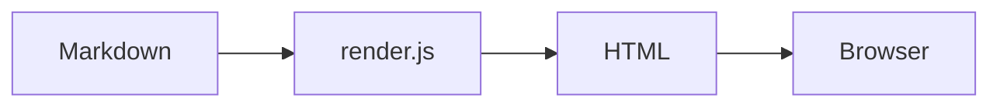

# Sample Document

A small markdown file used by the dropkit quickstart and as a sanity input
for the `markdown-to-html` skill.

## Headings and text

This is a regular paragraph with **bold**, *italic*, and `inline code`.
Here is a [link](https://example.com).

**Note:** Callout patterns like this one (Note / Tip / Warning / Important / Stop)
are detected by the renderer and styled as boxed callouts.

**Tip:** Use `--theme green` or `--theme rose` to change the accent palette.

**Warning:** The Mermaid CDN is the only external resource the rendered HTML
depends on. Pass `--no-mermaid` to skip it for fully offline files.

## Lists

Unordered:

- one
- two
  - nested two-a
  - nested two-b
- three

Ordered:

1. step one
2. step two
3. step three

## Tables

| Skill | Category | Deps |
|---|---|---|
| jira | integrations | pip |
| markdown-to-html | converters | npm `marked`, `highlight.js` |
| confluence-crawler | crawlers | pip |

## Code

```js
function greet(name) {
  return `hello, ${name}`;
}
console.log(greet('dropkit'));
```

```python
from pathlib import Path
print(Path('.').resolve())
```

## Blockquote

> The best agent architecture is a small sharp model orchestrating a pile
> of boring deterministic scripts.

## Diagram



## End

That's all. Open the rendered HTML in a browser to see it styled.
